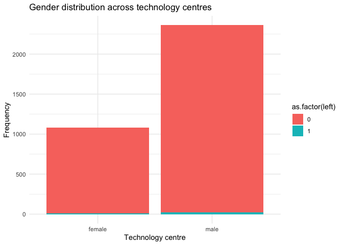

Exercise 3
================

## Open data file

``` r
library(arrow)
```

    ## 
    ## Attaching package: 'arrow'

    ## The following object is masked from 'package:utils':
    ## 
    ##     timestamp

``` r
library(tidyverse)
```

    ## ── Attaching core tidyverse packages ──────────────────────── tidyverse 2.0.0 ──
    ## ✔ dplyr     1.1.2     ✔ readr     2.1.4
    ## ✔ forcats   1.0.0     ✔ stringr   1.5.0
    ## ✔ ggplot2   3.4.2     ✔ tibble    3.2.1
    ## ✔ lubridate 1.9.2     ✔ tidyr     1.3.0
    ## ✔ purrr     1.0.1

    ## ── Conflicts ────────────────────────────────────────── tidyverse_conflicts() ──
    ## ✖ lubridate::duration() masks arrow::duration()
    ## ✖ dplyr::filter()       masks stats::filter()
    ## ✖ dplyr::lag()          masks stats::lag()
    ## ℹ Use the conflicted package (<http://conflicted.r-lib.org/>) to force all conflicts to become errors

``` r
library(broom)
applications <- read_feather("/Users/ankur/2023_People_Analytics/app_data_starter.feather")
```

``` r
# Create a vector of labels
cleaned <- applications %>%
  distinct(examiner_id, .keep_all = TRUE) %>%
  select(examiner_id, gender, race, tenure_days, tc, examiner_art_unit)
```

## Look at examiners demographics

``` r
library(dplyr)

applications %>%
  distinct(examiner_id) %>%
  count()
```

    ## # A tibble: 1 × 1
    ##       n
    ##   <int>
    ## 1  5649

### Overall distribution of Gender

``` r
library(dplyr)
library(ggplot2)

applications %>%
  group_by(gender) %>%
  #filter(!is.na(gender)) %>%
  summarise(n = n_distinct(examiner_id)) %>%
  ggplot(aes(x = as.factor(gender), y = n, fill = gender)) +
  geom_col() +
  ggtitle("Gender Distribution overall") + 
  ylab("Examiners") +
  xlab("")
```

<!-- --> \###
Finding: Number of males is higer than the females ( more than double).
Consdering gender NA could be male or ffemale the ratio could be more
balnced or unbalanced depending on the actual gender of NA. It maybe
unavailable due to foreign names which are not present in the wru
package.

### Overall distribution of Race

``` r
library(dplyr)
library(ggplot2)

applications %>%
  group_by(race) %>%
  #filter(!is.na(race)) %>%
  summarise(n = n_distinct(examiner_id)) %>%
  ggplot(aes(x = as.factor(race), y = n, fill = race)) +
  geom_col() +
  ggtitle("Race Distribution overall") + 
  ylab("Examiners") +
  xlab("")
```

<!-- --> \###
Finding: White race has the highest representation foolowed by Asian.
Balck and Hispanic are almost equal and are the minorities. Also, there
might be a chance that people predicted white could be wrong as other
races could have White names as well.

### Overall Distribution of Tenure Days

``` r
applications %>%
  group_by(tenure_days) %>%
  #filter(!is.na(tenure_days)) %>%
  summarise(n = n_distinct(examiner_id)) %>%
  ggplot(aes(x = tenure_days)) + 
  geom_histogram(binwidth = 365) +
  ggtitle("Overall Tenure distribution") +
  xlab("Tenure (years)") +
  scale_x_continuous(labels = function(x) x / 365, breaks = seq(0, max(applications$tenure_days, na.rm = TRUE), by = 365))+
  ylab("Frequency")+
  theme_minimal()+
  labs(fill = "")
```

    ## Warning: Removed 1 rows containing non-finite values (`stat_bin()`).

<!-- --> \###
Finding: The number of people with tenure from 13-17 is around the same,
with the number gradually increasing after 8 years(which has the people
with least tenure)

### Compare TCs by gender graphically

``` r
library(dplyr)
library(ggplot2)

applications %>%
  group_by(tc, gender) %>%
  #filter(!is.na(gender)) %>%
  summarise(n = n_distinct(examiner_id)) %>%
  ggplot(aes(x = as.factor(tc), y = n, fill = gender)) +
  geom_col(position = "dodge") +
  ggtitle("Gender Distribution by TCs") + 
  ylab("Examiners") +
  xlab("TCs")
```

    ## `summarise()` has grouped output by 'tc'. You can override using the `.groups`
    ## argument.

<!-- -->
\### Finding: TC 1600 has a good ration of males and females, while TC
2100 has the worst ratio.

## Compare TCs by Race distribution

``` r
library(dplyr)
library(ggplot2)

applications %>%
  group_by(tc, race) %>%
  #filter(!is.na(race)) %>%
  summarise(n = n_distinct(examiner_id)) %>%
  ggplot(aes(x = as.factor(tc), y = n, fill = race)) +
  geom_col(position = "dodge") +
  ggtitle("Race Distribution by TCs") + 
  ylab("Examiners") +
  xlab("TCs")
```

    ## `summarise()` has grouped output by 'tc'. You can override using the `.groups`
    ## argument.

<!-- -->

### Findings: As white population is the highest it has the most number of people in the TCs and almost all TCs have equal representation ratio of each race.

## Compare TCs by Tenure

``` r
applications %>%
  group_by(tc, tenure_days) %>%
  #filter(!is.na(tenure_days)) %>%
  summarise(n = n_distinct(examiner_id)) %>%
ggplot(aes(fill = as.factor(tc), x = tenure_days)) + 
  geom_histogram(binwidth = 365) +
  ggtitle("Tenure distribution across technology centres") +
  xlab("Tenure (years)") +
  scale_x_continuous(labels = function(x) x / 365, breaks = seq(0, max(applications$tenure_days, na.rm = TRUE), by = 365))+
  ylab("Examiners")+
  theme_minimal()+
  labs(fill = "Technology Centre")
```

    ## `summarise()` has grouped output by 'tc'. You can override using the `.groups`
    ## argument.

    ## Warning: Removed 4 rows containing non-finite values (`stat_bin()`).

<!-- -->
\## Finding: The tenure distribution across the dataset reveals an
intriguing pattern. The majority of individuals exhibit a pronounced
spike in tenure, particularly those who have been with the organization
for 16 years or longer. However, this trend does not hold true for
Technology Centre 2400, where the distribution of tenures appears to be
more evenly spread across the range.

### Compare WGs by gender graphically

``` r
library(dplyr)
library(ggplot2)

applications %>%
  group_by(examiner_art_unit, gender) %>%
  #filter(!is.na(gender)) %>%
  summarise(n = n_distinct(examiner_id)) %>%
  ggplot(aes(x = as.factor(examiner_art_unit), y = n, fill = gender)) +
  geom_col() +
  ggtitle("Gender Distribution by WGs") + 
  ylab("Examiners") +
  xlab("WGs")
```

    ## `summarise()` has grouped output by 'examiner_art_unit'. You can override using
    ## the `.groups` argument.

<!-- -->
\## Compare WGs by Race distribution

``` r
library(dplyr)
library(ggplot2)

applications %>%
  group_by(examiner_art_unit, race) %>%
  #filter(!is.na(race)) %>%
  summarise(n = n_distinct(examiner_id)) %>%
  ggplot(aes(x = examiner_art_unit, y = n, fill = race)) +
  geom_col(position = "dodge") +
  ggtitle("Race Distribution by WGs") + 
  ylab("Examiners") +
  xlab("WGs")
```

    ## `summarise()` has grouped output by 'examiner_art_unit'. You can override using
    ## the `.groups` argument.

<!-- -->

``` r
applications |> tbl_vars()
```

    ## <dplyr:::vars>
    ##  [1] "application_number"   "filing_date"          "examiner_name_last"  
    ##  [4] "examiner_name_first"  "examiner_name_middle" "examiner_id"         
    ##  [7] "examiner_art_unit"    "uspc_class"           "uspc_subclass"       
    ## [10] "patent_number"        "patent_issue_date"    "abandon_date"        
    ## [13] "disposal_type"        "appl_status_code"     "appl_status_date"    
    ## [16] "tc"                   "gender"               "race"                
    ## [19] "earliest_date"        "latest_date"          "tenure_days"

    ## Joining with `by = join_by(year)`

    ## # A tibble: 4 × 4
    ## # Groups:   gender [2]
    ##   gender  left     n     pct
    ##   <chr>  <dbl> <int>   <dbl>
    ## 1 female     0  1072 0.992  
    ## 2 female     1     9 0.00833
    ## 3 male       0  2338 0.990  
    ## 4 male       1    23 0.00974

    ## Joining with `by = join_by(examiner_id, min_year, max_year, tc, gender, race,
    ## year_left, left)`

    ## # A tibble: 5 × 5
    ##   term                estimate std.error statistic p.value
    ##   <chr>                  <dbl>     <dbl>     <dbl>   <dbl>
    ## 1 (Intercept)        0.00628     0.00431   1.46     0.145 
    ## 2 gendermale        -0.0000270   0.00394  -0.00687  0.995 
    ## 3 as.factor(tc)1700 -0.00179     0.00497  -0.360    0.719 
    ## 4 as.factor(tc)2100  0.00354     0.00503   0.705    0.481 
    ## 5 as.factor(tc)2400  0.0147      0.00591   2.49     0.0129

    ## 
    ## Call:
    ## lm(formula = left ~ gender + as.factor(tc), data = training_set)
    ## 
    ## Residuals:
    ##      Min       1Q   Median       3Q      Max 
    ## -0.02099 -0.00980 -0.00628 -0.00450  0.99553 
    ## 
    ## Coefficients:
    ##                     Estimate Std. Error t value Pr(>|t|)  
    ## (Intercept)        6.284e-03  4.313e-03   1.457   0.1452  
    ## gendermale        -2.704e-05  3.936e-03  -0.007   0.9945  
    ## as.factor(tc)1700 -1.787e-03  4.970e-03  -0.360   0.7191  
    ## as.factor(tc)2100  3.541e-03  5.026e-03   0.705   0.4811  
    ## as.factor(tc)2400  1.470e-02  5.908e-03   2.489   0.0129 *
    ## ---
    ## Signif. codes:  0 '***' 0.001 '**' 0.01 '*' 0.05 '.' 0.1 ' ' 1
    ## 
    ## Residual standard error: 0.09553 on 2921 degrees of freedom
    ## Multiple R-squared:  0.003429,   Adjusted R-squared:  0.002064 
    ## F-statistic: 2.513 on 4 and 2921 DF,  p-value: 0.03981

    ## [1] 1

## Findings

Due to the dataset’s size, we are unable to generate meaningful
predictions that carry significant value. Additionally, in the linear
model, none of the predictors exhibit statistical significance, and the
overall R-squared is exceptionally low. This outcome could be attributed
to the unsuitability of linear regression for predicting binary
outcomes.

### With race added

    ## # A tibble: 9 × 5
    ##   term               estimate std.error statistic p.value
    ##   <chr>                 <dbl>     <dbl>     <dbl>   <dbl>
    ## 1 (Intercept)        0.00246    0.00555    0.443   0.658 
    ## 2 gendermale        -0.000389   0.00395   -0.0983  0.922 
    ## 3 as.factor(tc)1700 -0.00198    0.00497   -0.399   0.690 
    ## 4 as.factor(tc)2100  0.00395    0.00512    0.772   0.440 
    ## 5 as.factor(tc)2400  0.0154     0.00600    2.57    0.0104
    ## 6 raceBlack         -0.00680    0.0101    -0.672   0.502 
    ## 7 raceHispanic       0.0238     0.0103     2.31    0.0210
    ## 8 raceOther         -0.00305    0.0676    -0.0452  0.964 
    ## 9 raceWhite          0.00484    0.00428    1.13    0.258

    ## 
    ## Call:
    ## lm(formula = left ~ gender + as.factor(tc) + race, data = training_set)
    ## 
    ## Residuals:
    ##      Min       1Q   Median       3Q      Max 
    ## -0.04162 -0.01087 -0.00692 -0.00493  0.99793 
    ## 
    ## Coefficients:
    ##                     Estimate Std. Error t value Pr(>|t|)  
    ## (Intercept)        0.0024598  0.0055496   0.443   0.6576  
    ## gendermale        -0.0003886  0.0039536  -0.098   0.9217  
    ## as.factor(tc)1700 -0.0019836  0.0049710  -0.399   0.6899  
    ## as.factor(tc)2100  0.0039498  0.0051181   0.772   0.4403  
    ## as.factor(tc)2400  0.0153986  0.0060025   2.565   0.0104 *
    ## raceBlack         -0.0068012  0.0101278  -0.672   0.5019  
    ## raceHispanic       0.0237663  0.0102926   2.309   0.0210 *
    ## raceOther         -0.0030543  0.0676439  -0.045   0.9640  
    ## raceWhite          0.0048446  0.0042827   1.131   0.2581  
    ## ---
    ## Signif. codes:  0 '***' 0.001 '**' 0.01 '*' 0.05 '.' 0.1 ' ' 1
    ## 
    ## Residual standard error: 0.09549 on 2917 degrees of freedom
    ## Multiple R-squared:  0.005773,   Adjusted R-squared:  0.003047 
    ## F-statistic: 2.117 on 8 and 2917 DF,  p-value: 0.03109

    ## [1] 1

## Findings after adding race

The inclusion of race as a predictor has a minimal impact on enhancing
the model’s accuracy, but it remains insufficient for reliable
predictions on binary outcomes. Theoretically, adjusting the
classification thresholds could slightly improve the model’s
performance. However, determining an appropriate threshold poses
challenges and is a complex task.

## Plotting distributions to show turnover

``` r
ggplot(regression_data, aes(fill = as.factor(left), x = gender)) + 
  geom_bar() +
  ggtitle("Gender distribution across technology centres") +
  xlab("Technology centre") +
  ylab("Frequency")+
  theme_minimal()
```

<!-- -->
