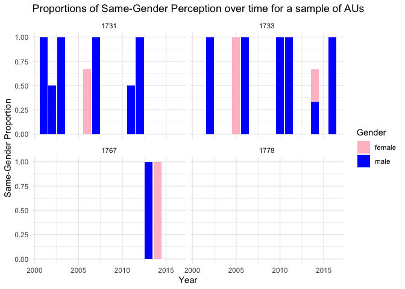
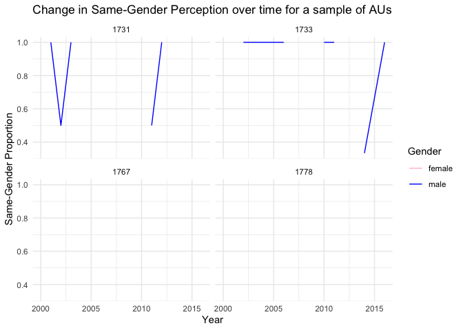

Exercise 4
================

### Selecting TC

``` r
tc1700 <- examiners %>%
  filter(tc == 1700) %>%
  drop_na(gender)
```

### Visualizing

I selected Technology Centre 1700 to analyze. I chose to remove
examiners with ‘NA’ in gender, which resulted in 125 examiner’s records
being removed (out of a total 1479 - approximately 8.5%).

One possible approach to address the absence of data would be to
randomly populate it using proportions similar to the existing
distribution of identified males and females. However, it is challenging
to determine whether this approach would yield reasonably accurate
results or provide meaningful insights.

To capture the changes in distributions and proportions over time, I
incorporated the years as part of the pre-processed data. This allows
for an analysis that takes into account the temporal aspect and provides
a more comprehensive understanding of how the variables evolve over
different time periods.

<!-- -->

<!-- --><!-- -->

<!-- --><!-- -->
\### Depicting perceptions of gender composition

    ## Warning: Removed 22 rows containing missing values (`position_stack()`).

<!-- -->

    ## Warning: Removed 10 rows containing missing values (`geom_line()`).

<!-- -->

## Observations on Gender Proportions at Different Levels

As we analyze the data at various levels, including Technology Centre
(TC), Art Unit, and Work Group (WG), we observe notable differences in
gender proportions. At the TC level, there is considerable variation,
with some TCs having significantly more women or men on average.
However, as we zoom in to the WG level and examine the data over time,
we notice a tendency for gender proportions to even out.

An exception to this trend is WG 1600, which deviates from the overall
pattern. This could be attributed to the fact that WG 1600 has a lower
total number of examiners compared to the other seven WGs. Additionally,
the data for WG 1600 starts from 2004, suggesting that it may be a
relatively new workgroup that has not yet reached the maturity levels of
others.

At the art unit level, it is challenging to identify a clear trend.
However, in general, if the gender proportion in one year decreases,
there is a tendency for it to increase in the following year. This
pattern could indicate intentional hiring decisions aimed at achieving
gender balance within teams, although accurately measuring the impact is
difficult.

Among the examined Technology Centres (TCs), TC 1600 exhibits the most
balanced distribution of gender proportions. On the other hand, TC 2100
appears to be predominantly male-dominated, closely followed by TC 2400.

In summary, conscious efforts to equalize gender proportions appear to
be more prominent at the TC level. These efforts may trickle down to the
WG level and subsequently impact the art units. As long as the gender
metrics at the TC level demonstrate equality, some level of variation at
the smaller levels can be tolerated
