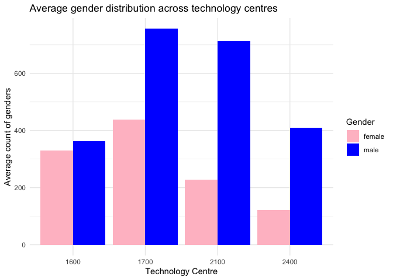
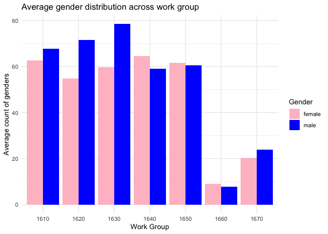
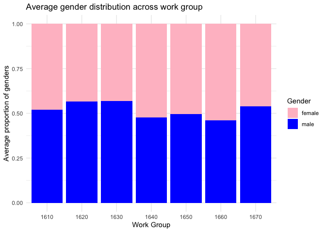
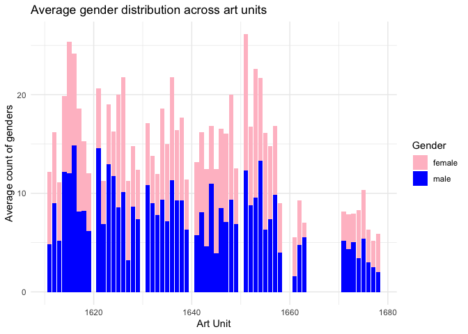
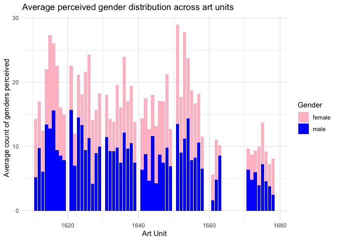
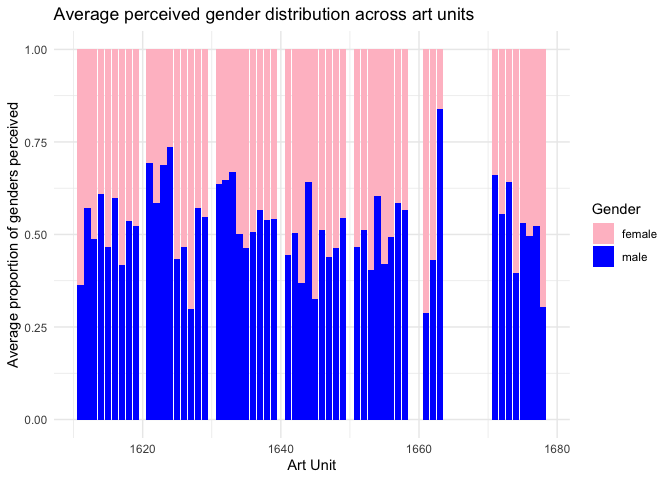
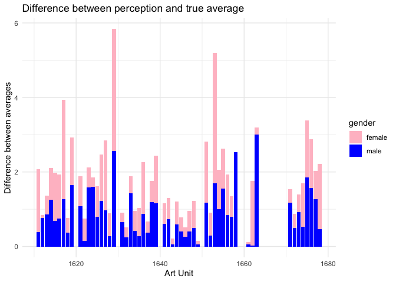
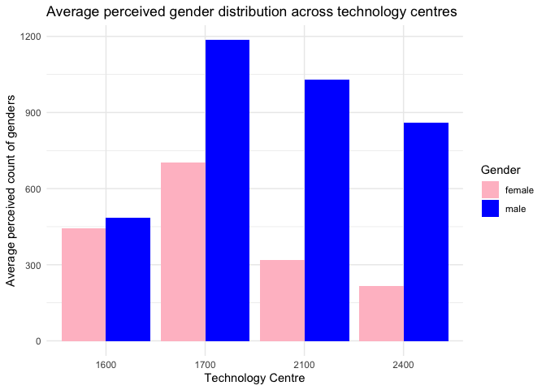

Exercise 5
================

## Initial data manipulation

``` r
applications <- applications %>%
  mutate(wg = (floor(examiner_art_unit / 10) * 10)) %>%
  mutate(year = year(appl_status_date)) %>%
  filter(year <= 2017) %>%
  drop_na(examiner_id)
```

``` r
examiners <- applications %>%
  group_by(examiner_id, examiner_art_unit, year) %>%
  summarise( 
    gender = first(gender),
    race = first(race),
    tc = first(tc),
    wg = first(wg)
    ) %>%
  drop_na(gender)
```

``` r
#creating datasets for gender counts by tc, wg and art unit

averages_au <- examiners %>%
  group_by(examiner_art_unit, gender, year) %>%
  summarise(gender_count_au = n_distinct(examiner_id),
            tc = first(tc),
            wg = first(wg))

averages_tc <- averages_au %>%
  group_by(tc, gender, year) %>%
  summarize(gender_count_tc = sum(gender_count_au))

averages_wg <- averages_au %>%
  group_by(wg, gender, year) %>%
  summarize(gender_count_wg = sum(gender_count_au),
            tc = first(tc)) 
```

## Visualizing average distributions across TC, WG and AU

``` r
#plotting raw counts
averages_tc %>%
  group_by(tc, gender) %>%
  summarize(y = mean(gender_count_tc)) %>%
  ggplot(aes(x = as.factor(tc), y = y, fill = gender)) +
  geom_col(position = "dodge")+
  labs(x = "Technology Centre", y = "Average count of genders", fill = "Gender") +
  ggtitle("Average gender distribution across technology centres") +
  theme_minimal() +
  scale_fill_manual(values = c("male" = "blue", "female" = "pink"))
```

<!-- -->

``` r
#plotting proportions
averages_tc %>%
  group_by(tc, gender) %>%
  summarize(y = mean(gender_count_tc)) %>%
  ggplot(aes(x = as.factor(tc), y = y, fill = gender)) +
  geom_col(position = "fill")+
  labs(x = "Technology Centre", y = "Average proportion of genders", fill = "Gender") +
  ggtitle("Average gender distribution across technology centres") +
  theme_minimal() +
  scale_fill_manual(values = c("male" = "blue", "female" = "pink"))
```

<!-- -->

``` r
#selecting tc 1600 to analyze
averages_wg <- averages_wg %>%
  filter(tc=="1600") %>%
  filter(wg >= "1610")
  
#plotting raw counts
averages_wg %>%
  group_by(wg, gender) %>%
  summarize(y = mean(gender_count_wg)) %>%
  ggplot(aes(x = as.factor(wg), y = y, fill = gender)) +
  geom_col(position = "dodge")+
  labs(x = "Work Group", y = "Average count of genders", fill = "Gender") +
  ggtitle("Average gender distribution across work group") +
  theme_minimal() +
  scale_fill_manual(values = c("male" = "blue", "female" = "pink"))
```

<!-- -->

``` r
#plotting proportions
averages_wg %>%
  group_by(wg, gender) %>%
  summarize(y = mean(gender_count_wg)) %>%
  ggplot(aes(x = as.factor(wg), y = y, fill = gender)) +
  geom_col(position = "fill")+
  labs(x = "Work Group", y = "Average proportion of genders", fill = "Gender") +
  ggtitle("Average gender distribution across work group") +
  theme_minimal() +
  scale_fill_manual(values = c("male" = "blue", "female" = "pink"))
```

<!-- -->

``` r
averages_au_1600 <- averages_au %>%
  filter(tc=="1600") %>%
  filter(examiner_art_unit >= "1610")

#plotting raw counts
averages_au_1600 %>%
  group_by(examiner_art_unit, gender) %>%
  summarize(y = mean(gender_count_au)) %>%
  ggplot(aes(x = examiner_art_unit, y = y, fill = gender)) +
  geom_col(position = "stack")+
  labs(x = "Art Unit", y = "Average count of genders", fill = "Gender") +
  ggtitle("Average gender distribution across art units") +
  theme_minimal() +
  scale_fill_manual(values = c("male" = "blue", "female" = "pink"))
```

<!-- -->

``` r
#plotting proportions
averages_au_1600 %>%
  group_by(examiner_art_unit, gender) %>%
  summarize(y = mean(gender_count_au)) %>%
  ggplot(aes(x = examiner_art_unit, y = y, fill = gender)) +
  geom_col(position = "fill")+
  labs(x = "Art Unit", y = "Average proportion of genders", fill = "Gender") +
  ggtitle("Average gender distribution across art units") +
  theme_minimal() +
  scale_fill_manual(values = c("male" = "blue", "female" = "pink"))
```

<!-- -->

## Looking at individual examiner’s perspectives

``` r
#creating perception variables
perception_average_au <- averages_au_1600 %>%
  group_by(examiner_art_unit, year) %>%
  mutate(total_count = sum(gender_count_au)) %>%
  ungroup() %>%
  mutate(total_percep = gender_count_au*total_count) %>%
  group_by(examiner_art_unit, gender) %>%
  summarize(avg_percep = sum(total_percep)/sum(total_count),
            true_avg = mean(gender_count_au)
            )

#plotting average perception counts
perception_average_au %>%
  ggplot(aes(x = examiner_art_unit, y = avg_percep, fill = gender)) +
  geom_col(position = "stack")+
  labs(x = "Art Unit", y = "Average count of genders perceived", fill = "Gender") +
  ggtitle("Average perceived gender distribution across art units") +
  theme_minimal() +
  scale_fill_manual(values = c("male" = "blue", "female" = "pink"))
```

<!-- -->

``` r
#plotting average perception proportions
perception_average_au %>%
  ggplot(aes(x = examiner_art_unit, y = avg_percep, fill = gender)) +
  geom_col(position = "fill")+
  labs(x = "Art Unit", y = "Average proportion of genders perceived", fill = "Gender") +
  ggtitle("Average perceived gender distribution across art units") +
  theme_minimal() +
  scale_fill_manual(values = c("male" = "blue", "female" = "pink"))
```

<!-- -->

``` r
#plotting the difference between perception and true average
perception_average_au %>%
  group_by(examiner_art_unit, gender) %>%
  summarize(y = avg_percep - true_avg) %>%
  ggplot(aes(x = examiner_art_unit, y = y, fill= gender))+
  geom_col() +
  labs(x = "Art Unit", y = "Difference between averages") +
  ggtitle("Difference between perception and true average") +
  theme_minimal() +
  scale_fill_manual(values = c("male" = "blue", "female" = "pink"))
```

<!-- -->

``` r
#extrapolating tc perception from individual art unit level
perception_average_tc <- averages_au %>%
  group_by(examiner_art_unit, year) %>%
  mutate(total_count = sum(gender_count_au)) %>%
  ungroup() %>%
  mutate(total_percep = gender_count_au*total_count) %>%
  group_by(examiner_art_unit, gender) %>%
  summarize(avg_percep = sum(total_percep)/sum(total_count),
            tc=first(tc)) %>%
  group_by(tc,gender) %>%
  summarize(perceived = sum(avg_percep))

#plotting the 'true average' proportion for tc we got earlier
averages_tc %>%
  group_by(tc, gender) %>%
  summarize(y = mean(gender_count_tc)) %>%
  ggplot(aes(x = as.factor(tc), y = y, fill = gender)) +
  geom_col(position = "fill")+
  labs(x = "Technology Centre", y = "Average proportion of genders", fill = "Gender") +
  ggtitle("Average gender distribution across technology centres") +
  theme_minimal() +
  scale_fill_manual(values = c("male" = "blue", "female" = "pink"))
```

<!-- -->

``` r
#plotting the perceived average proportion for tc
perception_average_tc %>%
  ggplot(aes(x = as.factor(tc), y = perceived, fill = gender)) +
  geom_col(position = "fill")+
  labs(x = "Technology Centre", y = "Average perceived proportion of genders", fill = "Gender") +
  ggtitle("Average perceived gender distribution across technology centres") +
  theme_minimal() +
  scale_fill_manual(values = c("male" = "blue", "female" = "pink"))
```

<!-- -->

``` r
#plotting the perceived average counts for tc
perception_average_tc %>%
  ggplot(aes(x = as.factor(tc), y = perceived, fill = gender)) +
  geom_col(position = "dodge")+
  labs(x = "Technology Centre", y = "Average perceived count of genders", fill = "Gender") +
  ggtitle("Average perceived gender distribution across technology centres") +
  theme_minimal() +
  scale_fill_manual(values = c("male" = "blue", "female" = "pink"))
```

<!-- -->

## Discussion and thoughts

To enhance the analysis, I adopted a specific approach. First, I
introduced a “year” variable and utilized it for grouping to obtain more
precise representations of the gender composition for each year. To
ensure consistency, I calculated the average gender distribution across
the years for each level of division. Subsequently, I focused on
analyzing TC1600 while excluding data from WG 1600 (1600-1609) due to
its minimal number of processed applications, suggesting it to be an
administrative work group.

To illustrate perception, I devised a new variable by multiplying the
total count of examiners in a given art unit by the count for each
gender. For instance, if there were 10 team members in a given year,
with 4 women, the new perception variable for women would be 40. To
determine the average perception, I divided the sum of this new variable
by the sum of the total counts across the years.

Notably, there were disparities between the perceived averages and the
“true” averages, which were magnified by the population size of each art
unit. AU 1629 exhibited the highest average difference in perception.

Furthermore, I extrapolated the averages from the art unit data to the
TC level, uncovering significant discrepancies in the numbers. Although
the proportions did not change drastically, there was a considerable
difference between the perceived counts and the actual averages. It is
noteworthy that based on the proportions, the perception of gender
equality showed a slight improvement for 1600 and 1700, while it
worsened for 2100 and 2400. Essentially, individual examiners perceived
more gender equality than what actually existed in 1600 and 1700, but
perceived less in 2100 and 2400.

To delve deeper into this phenomenon, it would be worthwhile to
investigate how perception evolved over time for art units, workgroups,
or technology centers, as this could have influenced the overall
averages. For instance, if a work group was perceived to have more
inequality in a particular year, it might lead to complaints and
subsequent changes in hiring policies the following year. Alternatively,
more individuals from the underrepresented gender might leave,
exacerbating the issue.
