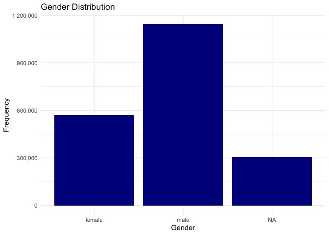
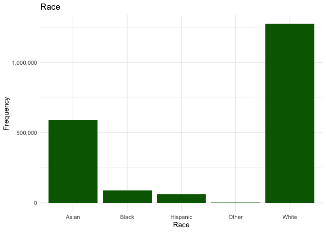
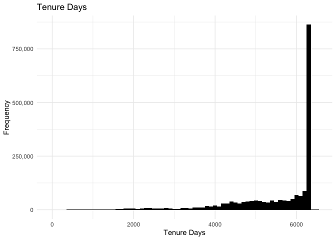
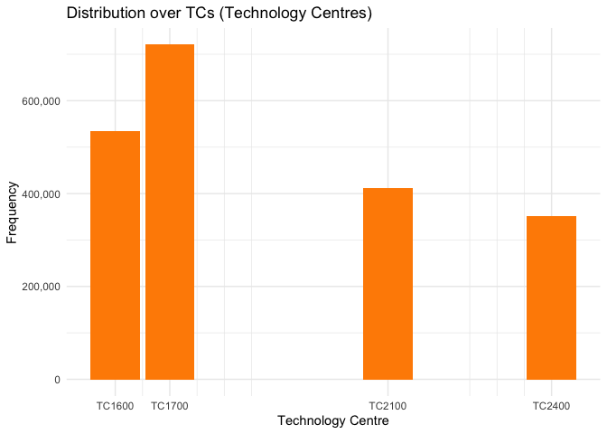
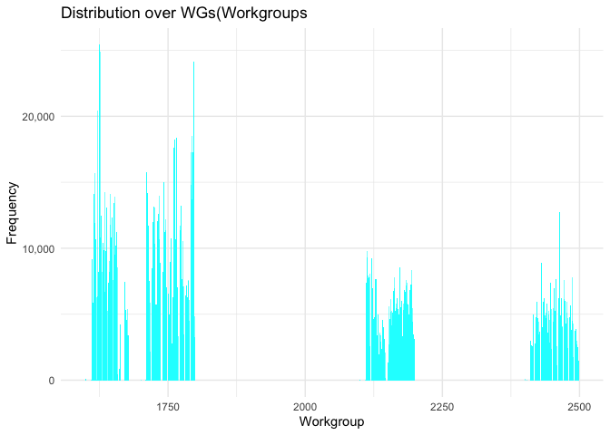

Exercise2
================

\##Ankur Katiyar

## Load data

Load the following data: + applications from `app_data_sample.parquet` +
edges from `edges_sample.csv`

``` r
# change to your own path!
data_path <- "/Users/ankur/2023_People_Analytics/"
applications <- read_parquet(paste0(data_path,"app_data_sample.parquet"))

applications
```

    ## # A tibble: 2,018,477 × 16
    ##    application_number filing_date examiner_name_last examiner_name_first
    ##    <chr>              <date>      <chr>              <chr>              
    ##  1 08284457           2000-01-26  HOWARD             JACQUELINE         
    ##  2 08413193           2000-10-11  YILDIRIM           BEKIR              
    ##  3 08531853           2000-05-17  HAMILTON           CYNTHIA            
    ##  4 08637752           2001-07-20  MOSHER             MARY               
    ##  5 08682726           2000-04-10  BARR               MICHAEL            
    ##  6 08687412           2000-04-28  GRAY               LINDA              
    ##  7 08716371           2004-01-26  MCMILLIAN          KARA               
    ##  8 08765941           2000-06-23  FORD               VANESSA            
    ##  9 08776818           2000-02-04  STRZELECKA         TERESA             
    ## 10 08809677           2002-02-20  KIM                SUN                
    ## # ℹ 2,018,467 more rows
    ## # ℹ 12 more variables: examiner_name_middle <chr>, examiner_id <dbl>,
    ## #   examiner_art_unit <dbl>, uspc_class <chr>, uspc_subclass <chr>,
    ## #   patent_number <chr>, patent_issue_date <date>, abandon_date <date>,
    ## #   disposal_type <chr>, appl_status_code <dbl>, appl_status_date <chr>,
    ## #   tc <dbl>

## Get gender for examiners

We’ll get gender based on the first name of the examiner, which is
recorded in the field `examiner_name_first`. We’ll use library `gender`
for that, relying on a modified version of their own
[example](https://cran.r-project.org/web/packages/gender/vignettes/predicting-gender.html).

Note that there are over 2 million records in the applications table –
that’s because there are many records for each examiner, as many as the
number of applications that examiner worked on during this time frame.
Our first step therefore is to get all *unique* names in a separate list
`examiner_names`. We will then guess gender for each one and will join
this table back to the original dataset. So, let’s get names without
repetition:

``` r
library(gender)
#install_genderdata_package() # only run this line the first time you use the package, to get data for it

# get a list of first names without repetitions
examiner_names <- applications %>% 
  distinct(examiner_name_first)

examiner_names
```

    ## # A tibble: 2,595 × 1
    ##    examiner_name_first
    ##    <chr>              
    ##  1 JACQUELINE         
    ##  2 BEKIR              
    ##  3 CYNTHIA            
    ##  4 MARY               
    ##  5 MICHAEL            
    ##  6 LINDA              
    ##  7 KARA               
    ##  8 VANESSA            
    ##  9 TERESA             
    ## 10 SUN                
    ## # ℹ 2,585 more rows

Now let’s use function `gender()` as shown in the example for the
package to attach a gender and probability to each name and put the
results into the table `examiner_names_gender`

``` r
# get a table of names and gender
examiner_names_gender <- examiner_names %>% 
  do(results = gender(.$examiner_name_first, method = "ssa")) %>% 
  unnest(cols = c(results), keep_empty = TRUE) %>% 
  select(
    examiner_name_first = name,
    gender,
    proportion_female
  )

examiner_names_gender
```

    ## # A tibble: 1,822 × 3
    ##    examiner_name_first gender proportion_female
    ##    <chr>               <chr>              <dbl>
    ##  1 AARON               male              0.0082
    ##  2 ABDEL               male              0     
    ##  3 ABDOU               male              0     
    ##  4 ABDUL               male              0     
    ##  5 ABDULHAKIM          male              0     
    ##  6 ABDULLAH            male              0     
    ##  7 ABDULLAHI           male              0     
    ##  8 ABIGAIL             female            0.998 
    ##  9 ABIMBOLA            female            0.944 
    ## 10 ABRAHAM             male              0.0031
    ## # ℹ 1,812 more rows

Finally, let’s join that table back to our original applications data
and discard the temporary tables we have just created to reduce clutter
in our environment.

``` r
# remove extra colums from the gender table
examiner_names_gender <- examiner_names_gender %>% 
  select(examiner_name_first, gender)

# joining gender back to the dataset
applications <- applications %>% 
  left_join(examiner_names_gender, by = "examiner_name_first")

# cleaning up
rm(examiner_names)
rm(examiner_names_gender)
gc()
```

    ##            used  (Mb) gc trigger  (Mb) limit (Mb) max used  (Mb)
    ## Ncells  4477732 239.2    8234891 439.8         NA  4895601 261.5
    ## Vcells 49462872 377.4   95366537 727.6      16384 79778520 608.7

## Guess the examiner’s race

We’ll now use package `wru` to estimate likely race of an examiner. Just
like with gender, we’ll get a list of unique names first, only now we
are using surnames.

``` r
library(wru)

examiner_surnames <- applications %>% 
  select(surname = examiner_name_last) %>% 
  distinct()

examiner_surnames
```

    ## # A tibble: 3,806 × 1
    ##    surname   
    ##    <chr>     
    ##  1 HOWARD    
    ##  2 YILDIRIM  
    ##  3 HAMILTON  
    ##  4 MOSHER    
    ##  5 BARR      
    ##  6 GRAY      
    ##  7 MCMILLIAN 
    ##  8 FORD      
    ##  9 STRZELECKA
    ## 10 KIM       
    ## # ℹ 3,796 more rows

We’ll follow the instructions for the package outlined here
<https://github.com/kosukeimai/wru>.

``` r
examiner_race <- predict_race(voter.file = examiner_surnames, surname.only = T) %>% 
  as_tibble()
```

    ## Warning: Unknown or uninitialised column: `state`.

    ## Proceeding with last name predictions...

    ## ℹ All local files already up-to-date!

    ## 701 (18.4%) individuals' last names were not matched.

``` r
examiner_race
```

    ## # A tibble: 3,806 × 6
    ##    surname    pred.whi pred.bla pred.his pred.asi pred.oth
    ##    <chr>         <dbl>    <dbl>    <dbl>    <dbl>    <dbl>
    ##  1 HOWARD       0.597   0.295    0.0275   0.00690   0.0741
    ##  2 YILDIRIM     0.807   0.0273   0.0694   0.0165    0.0798
    ##  3 HAMILTON     0.656   0.239    0.0286   0.00750   0.0692
    ##  4 MOSHER       0.915   0.00425  0.0291   0.00917   0.0427
    ##  5 BARR         0.784   0.120    0.0268   0.00830   0.0615
    ##  6 GRAY         0.640   0.252    0.0281   0.00748   0.0724
    ##  7 MCMILLIAN    0.322   0.554    0.0212   0.00340   0.0995
    ##  8 FORD         0.576   0.320    0.0275   0.00621   0.0697
    ##  9 STRZELECKA   0.472   0.171    0.220    0.0825    0.0543
    ## 10 KIM          0.0169  0.00282  0.00546  0.943     0.0319
    ## # ℹ 3,796 more rows

As you can see, we get probabilities across five broad US Census
categories: white, black, Hispanic, Asian and other. (Some of you may
correctly point out that Hispanic is not a race category in the US
Census, but these are the limitations of this package.)

Our final step here is to pick the race category that has the highest
probability for each last name and then join the table back to the main
applications table. See this example for comparing values across
columns: <https://www.tidyverse.org/blog/2020/04/dplyr-1-0-0-rowwise/>.
And this one for `case_when()` function:
<https://dplyr.tidyverse.org/reference/case_when.html>.

``` r
examiner_race <- examiner_race %>% 
  mutate(max_race_p = pmax(pred.asi, pred.bla, pred.his, pred.oth, pred.whi)) %>% 
  mutate(race = case_when(
    max_race_p == pred.asi ~ "Asian",
    max_race_p == pred.bla ~ "Black",
    max_race_p == pred.his ~ "Hispanic",
    max_race_p == pred.oth ~ "Other",
    max_race_p == pred.whi ~ "White",
    TRUE ~ NA_character_
  ))

examiner_race
```

    ## # A tibble: 3,806 × 8
    ##    surname    pred.whi pred.bla pred.his pred.asi pred.oth max_race_p race 
    ##    <chr>         <dbl>    <dbl>    <dbl>    <dbl>    <dbl>      <dbl> <chr>
    ##  1 HOWARD       0.597   0.295    0.0275   0.00690   0.0741      0.597 White
    ##  2 YILDIRIM     0.807   0.0273   0.0694   0.0165    0.0798      0.807 White
    ##  3 HAMILTON     0.656   0.239    0.0286   0.00750   0.0692      0.656 White
    ##  4 MOSHER       0.915   0.00425  0.0291   0.00917   0.0427      0.915 White
    ##  5 BARR         0.784   0.120    0.0268   0.00830   0.0615      0.784 White
    ##  6 GRAY         0.640   0.252    0.0281   0.00748   0.0724      0.640 White
    ##  7 MCMILLIAN    0.322   0.554    0.0212   0.00340   0.0995      0.554 Black
    ##  8 FORD         0.576   0.320    0.0275   0.00621   0.0697      0.576 White
    ##  9 STRZELECKA   0.472   0.171    0.220    0.0825    0.0543      0.472 White
    ## 10 KIM          0.0169  0.00282  0.00546  0.943     0.0319      0.943 Asian
    ## # ℹ 3,796 more rows

Let’s join the data back to the applications table.

``` r
# removing extra columns
examiner_race <- examiner_race %>% 
  select(surname,race)

applications <- applications %>% 
  left_join(examiner_race, by = c("examiner_name_last" = "surname"))

rm(examiner_race)
rm(examiner_surnames)
gc()
```

    ##            used  (Mb) gc trigger  (Mb) limit (Mb) max used  (Mb)
    ## Ncells  4658651 248.8    8234891 439.8         NA  7358673 393.0
    ## Vcells 51796842 395.2   95366537 727.6      16384 94095417 717.9

## Examiner’s tenure

To figure out the timespan for which we observe each examiner in the
applications data, let’s find the first and the last observed date for
each examiner. We’ll first get examiner IDs and application dates in a
separate table, for ease of manipulation. We’ll keep examiner ID (the
field `examiner_id`), and earliest and latest dates for each application
(`filing_date` and `appl_status_date` respectively). We’ll use functions
in package `lubridate` to work with date and time values.

``` r
library(lubridate) # to work with dates

examiner_dates <- applications %>% 
  select(examiner_id, filing_date, appl_status_date) 

examiner_dates
```

    ## # A tibble: 2,018,477 × 3
    ##    examiner_id filing_date appl_status_date  
    ##          <dbl> <date>      <chr>             
    ##  1       96082 2000-01-26  30jan2003 00:00:00
    ##  2       87678 2000-10-11  27sep2010 00:00:00
    ##  3       63213 2000-05-17  30mar2009 00:00:00
    ##  4       73788 2001-07-20  07sep2009 00:00:00
    ##  5       77294 2000-04-10  19apr2001 00:00:00
    ##  6       68606 2000-04-28  16jul2001 00:00:00
    ##  7       89557 2004-01-26  15may2017 00:00:00
    ##  8       97543 2000-06-23  03apr2002 00:00:00
    ##  9       98714 2000-02-04  27nov2002 00:00:00
    ## 10       65530 2002-02-20  23mar2009 00:00:00
    ## # ℹ 2,018,467 more rows

The dates look inconsistent in terms of formatting. Let’s make them
consistent. We’ll create new variables `start_date` and `end_date`.

``` r
examiner_dates <- examiner_dates %>% 
  mutate(start_date = ymd(filing_date), end_date = as_date(dmy_hms(appl_status_date)))
```

Let’s now identify the earliest and the latest date for each examiner
and calculate the difference in days, which is their tenure in the
organization.

``` r
examiner_dates <- examiner_dates %>% 
  group_by(examiner_id) %>% 
  summarise(
    earliest_date = min(start_date, na.rm = TRUE), 
    latest_date = max(end_date, na.rm = TRUE),
    tenure_days = interval(earliest_date, latest_date) %/% days(1)
    ) %>% 
  filter(year(latest_date)<2018)

examiner_dates
```

    ## # A tibble: 5,625 × 4
    ##    examiner_id earliest_date latest_date tenure_days
    ##          <dbl> <date>        <date>            <dbl>
    ##  1       59012 2004-07-28    2015-07-24         4013
    ##  2       59025 2009-10-26    2017-05-18         2761
    ##  3       59030 2005-12-12    2017-05-22         4179
    ##  4       59040 2007-09-11    2017-05-23         3542
    ##  5       59052 2001-08-21    2007-02-28         2017
    ##  6       59054 2000-11-10    2016-12-23         5887
    ##  7       59055 2004-11-02    2007-12-26         1149
    ##  8       59056 2000-03-24    2017-05-22         6268
    ##  9       59074 2000-01-31    2017-03-17         6255
    ## 10       59081 2011-04-21    2017-05-19         2220
    ## # ℹ 5,615 more rows

Joining back to the applications data.

``` r
applications <- applications %>% 
  left_join(examiner_dates, by = "examiner_id")

rm(examiner_dates)
gc()
```

    ##            used  (Mb) gc trigger  (Mb) limit (Mb)  max used  (Mb)
    ## Ncells  4666800 249.3    8234891 439.8         NA   8234891 439.8
    ## Vcells 57871117 441.6  114519844 873.8      16384 114303963 872.1

\##Overall Distribution of Gender

    ## 
    ##  female    male 
    ##  571227 1143391

<!-- --> \##Overall
Distribution of Race

    ## 
    ##    Asian    Black Hispanic    Other    White 
    ##   591644    89559    58856     1891  1276527

<!-- --> \##Overall
Distribution of Tenure Days

    ## Warning: Removed 25863 rows containing non-finite values (`stat_bin()`).

<!-- -->
\##Distribution over TCs (Technology Centres)

    ## 
    ##   1600   1700   2100   2400 
    ## 535052 720599 411278 351548

<!-- --> \##Distribution
over WGs (Workgroups)

<!-- --> \##Correlation
between gender and race with tenure (not considering TC)

    ## 
    ## Call:
    ## lm(formula = tenure_days ~ 1 + factor(gender) + factor(race), 
    ##     data = applications)
    ## 
    ## Residuals:
    ##     Min      1Q  Median      3Q     Max 
    ## -5569.1  -564.8   542.2   796.2  1260.8 
    ## 
    ## Coefficients:
    ##                      Estimate Std. Error t value Pr(>|t|)    
    ## (Intercept)          5575.113      2.057 2710.04   <2e-16 ***
    ## factor(gender)male   -131.280      1.776  -73.90   <2e-16 ***
    ## factor(race)Black      94.490      4.846   19.50   <2e-16 ***
    ## factor(race)Hispanic -358.624      5.078  -70.62   <2e-16 ***
    ## factor(race)Other     321.607     31.351   10.26   <2e-16 ***
    ## factor(race)White      75.966      1.968   38.61   <2e-16 ***
    ## ---
    ## Signif. codes:  0 '***' 0.001 '**' 0.01 '*' 0.05 '.' 0.1 ' ' 1
    ## 
    ## Residual standard error: 1090 on 1700642 degrees of freedom
    ##   (317829 observations deleted due to missingness)
    ## Multiple R-squared:  0.008426,   Adjusted R-squared:  0.008423 
    ## F-statistic:  2890 on 5 and 1700642 DF,  p-value: < 2.2e-16

\##Correlation between gender and race with tenure considering TC

    ## 
    ## Call:
    ## lm(formula = tenure_days ~ 1 + factor(gender) + factor(race) + 
    ##     factor(tc), data = applications)
    ## 
    ## Residuals:
    ##     Min      1Q  Median      3Q     Max 
    ## -5598.1  -586.0   462.1   779.3  1665.5 
    ## 
    ## Coefficients:
    ##                      Estimate Std. Error  t value Pr(>|t|)    
    ## (Intercept)          5887.872      2.430 2423.443  < 2e-16 ***
    ## factor(gender)male    -17.159      1.781   -9.635  < 2e-16 ***
    ## factor(race)Black     107.638      4.722   22.793  < 2e-16 ***
    ## factor(race)Hispanic -398.776      4.950  -80.567  < 2e-16 ***
    ## factor(race)Other     219.608     30.554    7.187 6.61e-13 ***
    ## factor(race)White     -38.761      1.980  -19.574  < 2e-16 ***
    ## factor(tc)1700       -285.382      2.092 -136.400  < 2e-16 ***
    ## factor(tc)2100       -348.374      2.514 -138.547  < 2e-16 ***
    ## factor(tc)2400       -812.399      2.694 -301.518  < 2e-16 ***
    ## ---
    ## Signif. codes:  0 '***' 0.001 '**' 0.01 '*' 0.05 '.' 0.1 ' ' 1
    ## 
    ## Residual standard error: 1062 on 1700639 degrees of freedom
    ##   (317829 observations deleted due to missingness)
    ## Multiple R-squared:  0.05884,    Adjusted R-squared:  0.05884 
    ## F-statistic: 1.329e+04 on 8 and 1700639 DF,  p-value: < 2.2e-16

\##Conclusion

**Gender:** There are 1,143,391 males and 571,227 females,i.e the number
of males is double to that of females in the “United States Patent and
Trademark Office”(USPTO).

**Race:** The majority of the people are White (1,276,527), followed by
Asian (591,644), Black(89,559), Hispanic(58,856) and Other(1,891).

**Correlation:** Based on the above regression analysis, the gender and
race have significant associations with tenure in “USPTO”.

Without considering TC -

Regarding gender, the coefficient estimates indicate that being male is
associated with lower tenure days compared to females. The negative
coefficient of -131.280 suggests that, on average, males have 131.280
fewer tenure days than females when only gender and race are taken as
independent variables.

Regarding race, the coefficients reveal varying associations with tenure
days compared to the reference category (Asian). Black individuals have
a positive coefficient of 94.490, indicating that they tend to have
higher tenure days compared to Asians. Hispanics, on the other hand,
have a negative coefficient of -358.624, suggesting lower tenure days
compared to Asians. Other racial categories and Whites also have
positive coefficients, indicating higher tenure days compared to Asians.

Considering TC:

Regarding gender, the coefficient for males has gone higher than it was
without considering TC. Now, males have 17.159 fewer tenure days than
females when gender,race and TCs are taken as independent variables in
comparison to earlier 131.280 days.This tells us that the predictions
earlier attributed to gender may have more to do with difference in TCs.

Regarding Race, the coefficients have changed too. Black individuals now
have increased to 107.638 days of higher tenure compared to Asians.
Hispanic reduced to -398.776, Others reduced to 219.608 and White
reduced to -38.761 with the introduction of additional TC independent
variable.

Regarding TC, the coefficients are in comparison to TC 1600 , which
reflects the highest number of tenure days in comparison with other TCs.

The adjusted R-squared value increases from 0.008423 in the first model
(with only gender and race as predictors) to 0.05884 in the second model
(with gender, race, and tc as predictors). This suggests that the
inclusion of the “tc” variable improves the model’s ability to explain
the variance in tenure days.

The p-values associated with the coefficients for gender and race remain
highly significant in both models. Similarly, the coefficients for the
“tc” variable also have highly significant p-values. This indicates that
all of these variables have a significant impact on tenure days in the
organization.
